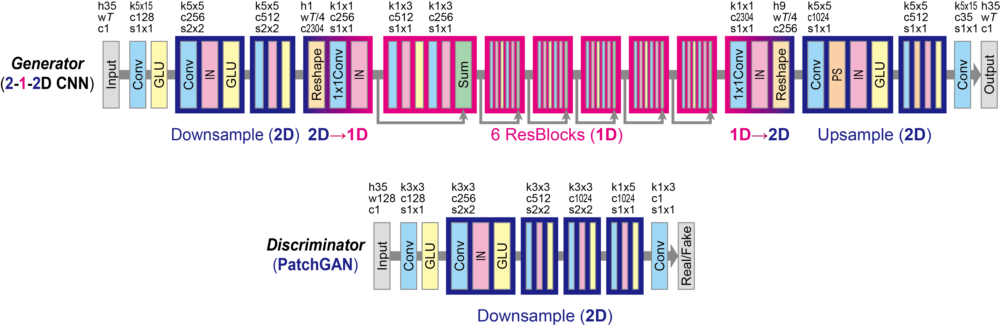
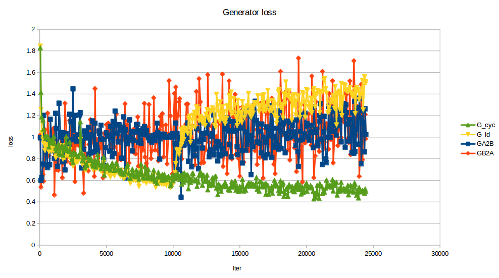
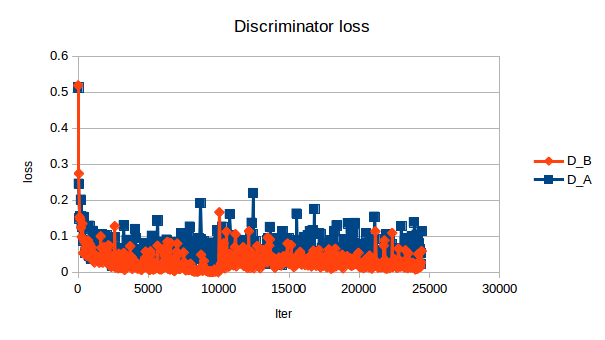

# CycleGAN-VC2
This code is based on https://github.com/pritishyuvraj/Voice-Conversion-GAN  
<p align="center">
  
</p>


## Usage

### Download Dataset

Download and unzip [VCC2016](https://datashare.is.ed.ac.uk/handle/10283/2211) dataset to designated directories.

```bash
$ python download.py --help
usage: download.py [-h] [--download_dir DOWNLOAD_DIR] [--data_dir DATA_DIR]
                   [--datasets DATASETS]

optional arguments:
  -h, --help            show this help message and exit
  --download_dir DOWNLOAD_DIR
                        Download directory for zipped data
  --data_dir DATA_DIR   Data directory for unzipped data
  --datasets DATASETS   Datasets available: vcc2016
```

For example, to download the datasets to ``download`` directory and extract to ``data`` directory:

```bash
$ python download.py --download_dir ./download --data_dir ./data --datasets vcc2016
```

### Preprocessing for Training
Preprocess voice data and stores it in numpy format in ../cache folder
```bash
$ python prepocess_training.py --help
Usage: preprocess_training.py [-h] [--train_A_dir TRAIN_A_DIR]
                              [--train_B_dir TRAIN_B_DIR]
                              [--cache_folder CACHE_FOLDER]

Prepare data for training Cycle GAN using PyTorch

optional arguments:
  -h, --help            show this help message and exit
  --train_A_dir TRAIN_A_DIR
                        Directory for source voice sample
  --train_B_dir TRAIN_B_DIR
                        Directory for target voice sample
  --cache_folder CACHE_FOLDER
                        Store preprocessed data in cache folders
```
For example, to train CycleGAN model for voice Conversion between ``SF1`` and ``TM1``:
```bash
$ python prepocess_training.py --train_A_dir ../data/vcc2016_training/SF1
                                --train_B_dir ../data/vcc2016_training/TM1
                                --cache_folder ../cache/
```                                

### Train Model

```bash
$python train.py --help
usage: train.py [-h] [--logf0s_normalization LOGF0S_NORMALIZATION]
                [--mcep_normalization MCEP_NORMALIZATION]
                [--coded_sps_A_norm CODED_SPS_A_NORM]
                [--coded_sps_B_norm CODED_SPS_B_NORM]
                [--model_checkpoint MODEL_CHECKPOINT]
                [--resume_training_at RESUME_TRAINING_AT]
                [--validation_A_dir VALIDATION_A_DIR]
                [--output_A_dir OUTPUT_A_DIR]
                [--validation_B_dir VALIDATION_B_DIR]
                [--output_B_dir OUTPUT_B_DIR]

                Train CycleGAN using source dataset and target dataset

                optional arguments:

                  -h, --help            show this help message and exit
                  --logf0s_normalization LOGF0S_NORMALIZATION
                                        Cached location for log f0s normalized
                  --mcep_normalization MCEP_NORMALIZATION
                                        Cached location for mcep normalization
                  --coded_sps_A_norm CODED_SPS_A_NORM
                                        mcep norm for data A
                  --coded_sps_B_norm CODED_SPS_B_NORM
                                        mcep norm for data B
                  --model_checkpoint MODEL_CHECKPOINT
                                        location where you want to save the odel
                  --resume_training_at RESUME_TRAINING_AT
                                        Location of the pre-trained model to resume training
                  --validation_A_dir VALIDATION_A_DIR
                                        validation set for sound source A
                  --output_A_dir OUTPUT_A_DIR
                                        output for converted Sound Source A
                  --validation_B_dir VALIDATION_B_DIR
                                        Validation set for sound source B
                  --output_B_dir OUTPUT_B_DIR
                                        Output for converted sound Source B
```  
For example, to train CycleGAN model for voice conversion between ``SF1`` and ``TF2``:

```bash
$python train.py --logf0s_normalization ../cache/logf0s_normalization.npz --mcep_normalization ../cache/mcep_normalization.npz --coded_sps_A_norm coded_sps_A_norm --coded_sps_B_norm coded_sps_B_norm --resume_training_at ../cache/model_checkpoint/_CycleGAN_CheckPoint --validation_A_dir ../data/vcc2016_training/evaluation_all/SF1/ --output_A_dir ../data/vcc2016_training/converted_sound/SF1 --validation_B_dir ../data/vcc2016_training/evaluation_all/TF2/ --output_B_dir ../data/vcc2016_training/converted_sound/TF2/
```                                                

### test model
```bash
$python test.py [--logf0s_normalization LOGF0S_NORMALIZATION]
                [--mcep_normalization MCEP_NORMALIZATION]
                [--model_checkpoint MODEL_CHECKPOINT]
                [--test_A_dir VALIDATION_A_DIR]
                [--output_A_dir OUTPUT_A_DIR]


                optional arguments:

                  --mcep_normalization MCEP_NORMALIZATION
                                        Cached location for mcep normalization
                  --model_checkpoint MODEL_CHECKPOINT
                                        location where your model saved
                  --test_A_dir VALIDATION_A_DIR
                                        test set for sound source A
                  --output_A_dir OUTPUT_A_DIR
                                        output for converted Sound Source A
```  

For example, to test CycleGAN model for voice conversion between ``SF1`` and ``TF2``:

```bash
$python test.py --logf0s_normalization ../cache/logf0s_normalization.npz --mcep_normalization ../cache/mcep_normalization.npz --test_A_dir ../data/vcc2016_training/evaluation_all/SF1/ --output_A_dir ../data/vcc2016_training/converted_sound/SF1 --model_checkpoint ./model/_CycleGAN_CheckPoint
```                                                

### result

<p align="center">
  
</p>  

<p align="center">
  
</p>  

vcc2016 TF1 to TM1 convert result in data/convert/history/  

